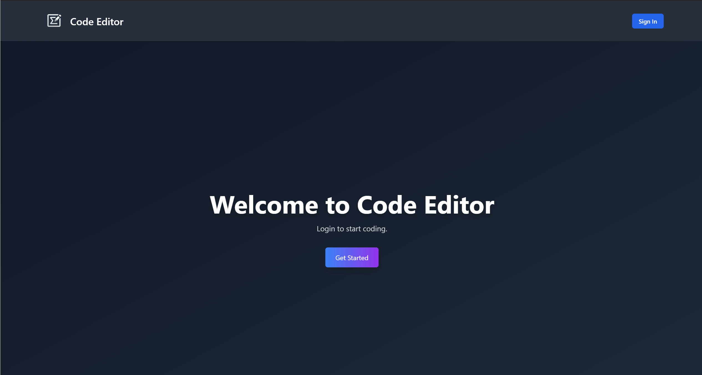
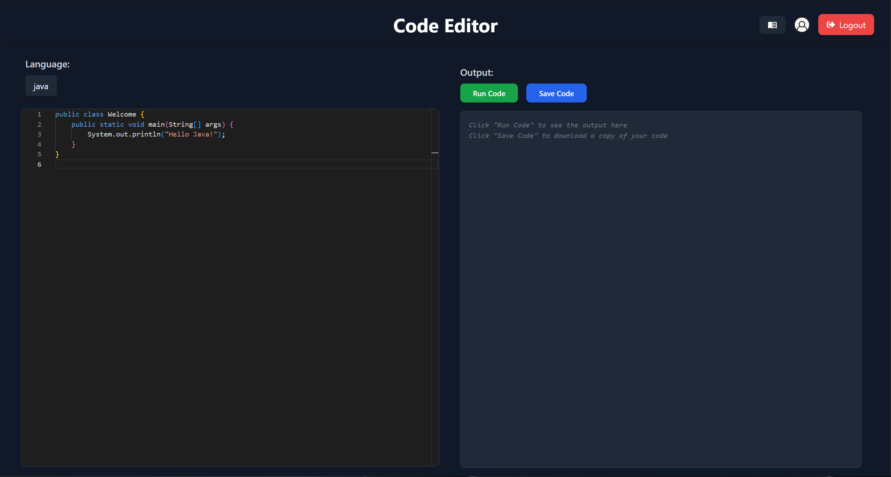
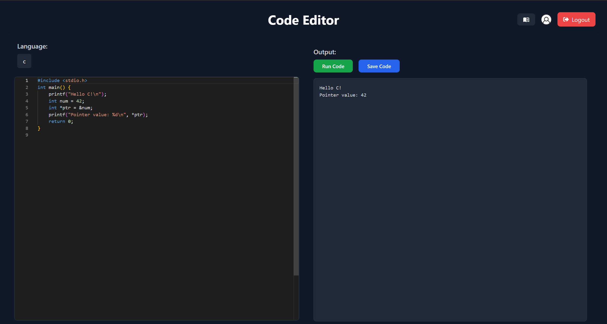

# Code Editor

## About the Project

**Code Editor** is a university project designed to provide a lightweight and modern environment for writing, running, and saving code in multiple programming languages.

### Features
- **Multi-Language Support**: Includes JavaScript, Python, Java, TypeScript, PHP, and C.
- **Code Execution**: Run code directly in the browser with instant output.
- **Save code**: Save your code to use it again.
- **Built-in Documentation**: Quick access to official documentation for supported languages.
- **User Authentication**: Secure login and logout functionality.

---

## Technologies Used

- **React**: Dynamic user interface and component-based development.
- **Monaco Editor**: The robust editor powering Visual Studio Code.
- **Firebase**: Authentication and backend integration.
- **Tailwind CSS**: For responsive and modern design.

---

## Screenshots

### Login Page

### Main Page

### Code Execution

---

## Purpose

This project was developed as part of a university course to demonstrate practical knowledge in:
- React development.
- Integrating third-party libraries like Monaco Editor and Firebase.
- Designing a functional and visually appealing user interface.

<strong>Enjoy coding with Code Editor!</strong>

